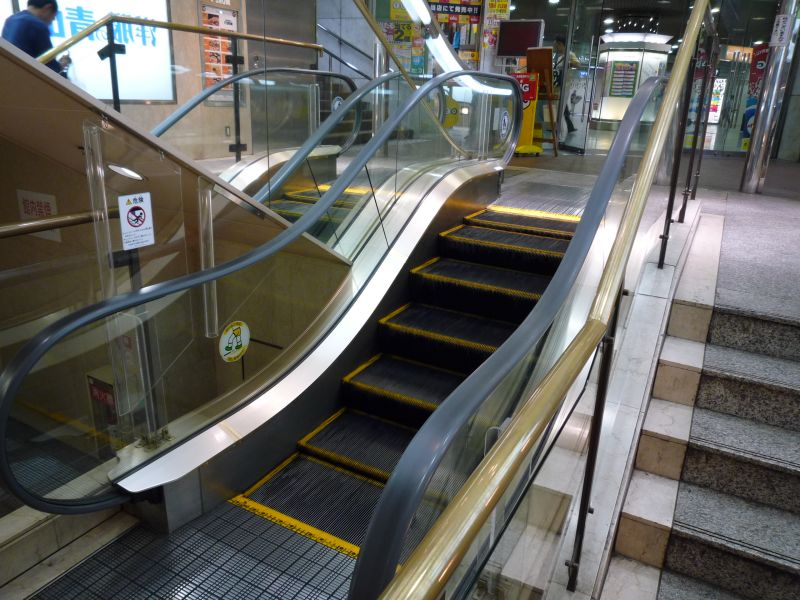

Hiện nay thang cuốn được sử dụng khá phổ biển trong các trung tâm thương mại, các siêu thị lớn nhỏ, hay các khu chung cư... bởi sự tiện lợi và phù hợp của nó. Tuy nhiên, đi cùng với đó là sự xuất hiện khá nhiều những vấn đề rắc rối và tai nạn mà nguyên nhân gây ra chính là thang cuốn. Chính vì Thang cuốn không đảm bảo an toàn cho người sử dụng và chưa được kiểm tra kỹ càng trước khi vận hành nên mới gây ra những tai nạn không đáng có. Do vậy, kiểm định thang cuốn chính là việc làm thực sự quan trọng và cần thiết khi sử dụng thang cuốn.

Hiện nay, việc kiểm định an toàn thang cuốn phải do các tổ chức kiểm định độc lập đủ điều kiện theo quy định tại Nghị định số 45/2013/NĐ-CP và Thông tư số 06/2014/TT-BLĐTBXH tiến hành thực hiện. Công ty Kiểm định an toàn 24h là đơn vị được chỉ định kiểm định an toàn thang cuốn đúng theo tiêu chuẩn của Bộ LĐTBXH đã chỉ định.

###Lý do nên tiến hành kiểm định an toàn thang cuốn

- Để người dùng luôn được bảo đảm sự an toàn khi dùng thang cuốn
- Giúp kéo dài hạn sử dụng và đảm bảo sự vận hành ổn định của thang cuốn
- Nhanh chóng phát hiện kịp thời và hạn chế hỏng hóc dẫn đến việc thay thế toàn bộ thiết bị thang cuốn.

###Thời điểm cần tiến hành kiểm định an toàn thang cuốn?

- Hết hạn kiểm định hoặc trước thời hạn theo đề nghị kiểm định an toàn thang cuốn của cơ sở quản lý, sử dụng thang cuốn.
- Sau khi đã khắc phục xong những tai nạn, sự cố nghiêm trọng xảy ra khi sử dụng thang cuốn
- Kiểm định an toàn thang cuốn ngay khi vừa lắp đặt xong và trước khi vận hành sử dụng
- Cần kiểm định an toàn thang cuốn ngay sau khi thực hiện những cải tạo, sửa chữa lớn
- Tiến hành kiểm định thang cuốn theo chỉ thị, yêu cầu của cơ quan thanh tra nhà nước.

Là một trong số những danh mục thiết bị bắt buộc phải tiến hành kiểm định an toàn, muốn đưa thanh cuốn vào vận hành, sử dụng thì các doanh nghiệp, tổ chức, cơ quan quản lý và cá nhân sử dụng phải có nghĩa vụ và trách nhiệm phối hợp với các đơn vị kiểm định thực hiện việc kiểm tra kiểm định thang cuốn theo quy định, đủ tiêu chuẩn mới được đưa vào sử dụng.

Đơn vị thực hiện dịch vụ kiểm định an toàn thang cuốn:

Công ty cổ phần kiểm định đo lường và huấn luyện an toàn Việt Nam

Trụ sở chính: .................

Văn phòng giao dịch: .................

Điện thoại: 0984.126.797 (Mr. Tùng)

Email: kiemdinh247@gmail.com