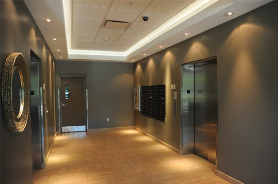

Nằm trong số những thiết bị bắt buộc phải được tiến hành kiểm định an toàn trước khi đưa vào vận hành, thang máy chính là thiết bị mà chúng ta đang nói đến. Theo thông tư 32 /2011/ TT-BLĐTBXH đã quy định, thang máy khi muốn đưa vào vận hành lần đầu tiên cũng như trong quá trình sử dụng cần phải được tiến hành kiểm định để đảm bảo an toàn cho người sử dụng.

###Thang máy là gì?

Đây là một thiết bị nâng để phục vụ việc vận chuyển ở các tầng dừng xác định. Thang máy có cabin với kích thước và kết cấu phù hợp để vận chuyển người hoặc hàng hoá lên xuống thẳng đứng hoặc nghiêng theo các ray dẫn.

Công tác kiểm định thang máy là hoạt động đánh giá tình trạng kỹ thuật an toàn thang máy theo quy chuẩn kỹ thuật quốc gia, tiêu chuẩn kỹ thuật an toàn bao gồm các đề mục:

- Kiểm định thang máy lần đầu: tức là kiểm định sau khi thang máy lắp đặt, trước khi đưa vào sử dụng.
- Kiểm định thang máy định kỳ: kiểm định khi hết thời hạn của lần kiểm định trước.
- Kiểm định thang máy bất thường: thực hiện sau khi tiến hành sửa chữa, nâng cấp, cải tạo có ảnh hưởng tới tình trạng kỹ thuật an toàn của thang máy; hoặc tiến hành khi có yêu cầu của cơ sở hoặc cơ quan có thẩm quyền.

### Kiểm định an toàn thang máy phải trải qua những bước dưới đây:

- Kiểm tra hồ sơ, lý lịch thang máy;
- Kiểm tra kỹ thuật bên ngoài;
- Kiểm tra kỹ thuật - thử không tải;
- Các hình thức thử tải - Phương pháp thử;
- Xử lý kết quả kiểm định.

**Chú ý**: Đương nhiên là chỉ khi việc tiến hành kiểm tra bước đầu tiên đạt kết quả đúng theo yêu cầu thì mới có đủ điều kiện để tiến hành các bước tiếp theo. Và mọi kết quả kiểm tra đã thực hiện của từng bước phải được lưu trữ đầy đủ vào bản ghi chép hiện trường theo mẫu qui định tại Phụ lục 01 và được bên kiểm định lưu lại đầy đủ.

### Công tác kiểm định thang máy diễn ra phải đảm bảo các điều kiện dưới đây:

- Thang máy cần phải được đặt ở trạng thái sẵn sàng đưa vào kiểm định an toàn
- Hồ sơ kỹ thuật để tiến hành kiểm định thang máy phải đầy đủ
- Cần đảm bảo rằng các yếu tố môi trường, thời tiết đủ điều kiện không làm ảnh hưởng tới kết quả kiểm định
- Các điều kiện về an toàn vệ sinh lao động phải đáp ứng để vận hành thang máy.

kiem dinh thang may 2

###Kết quả kiểm định thang máy có thời hạn trong bao lâu?

- Về cơ bản, thời hạn kiểm định thang máy định kỳ sẽ là 04 năm. Nhưng thời hạn kiểm định đối với thang máy điện đã sử dụng trên 20 năm thì chỉ là 1 năm.
- Trường hợp nhà sản xuất quy định hoặc cơ sở quản lý yêu cầu thời hạn kiểm định ngắn hơn thì thực hiện theo yêu cầu đó.  Tuy nhiên, nếu rút ngắn thời hạn kiểm định, kiểm định viên phải nêu rõ lý do trong biên bản kiểm định.
- Nếu thời hạn kiểm định được quy định trong các Quy chuẩn kỹ thuật Quốc gia thì thực hiện theo quy định của Quy chuẩn đó.

###Báo giá kiểm định thang máy theo quy định

- Thang máy có số điểm dừng dưới 10 tầng: 2.000.000đ
- Thang máy có số điểm dừng từ 10 tầng trở lên: 3.000.000đ
- Thang cuốn không kể năng suất: 2.200.000

Công ty cổ phần kiểm định đo lường và huấn luyện an toàn Việt Nam (STIM) là nơi tập hợp những cán bộ kiểm định có kinh nghiệm và được đào tạo thường xuyên nâng cao trình độ chuyên môn kỹ thuật. Do vậy, dịch vụ kiểm định thang máy của chúng tôi hoàn toàn chất lượng và đảm bảo đem lại kết quả đáng mong đợi trong công tác kiểm định an toàn thang máy cho các doanh nghiệp, tổ chức.

Nếu có bất kỳ thắc mắc nào cần hỗ trợ, Quý khách vui lòng liên hệ:

Công ty cổ phần kiểm định đo lường và huấn luyện an toàn Việt Nam

Trụ sở chính: .................

Văn phòng giao dịch: .................

Điện thoại: 0984.126.797 (Mr. Tùng)

Email: kiemdinh247@gmail.com