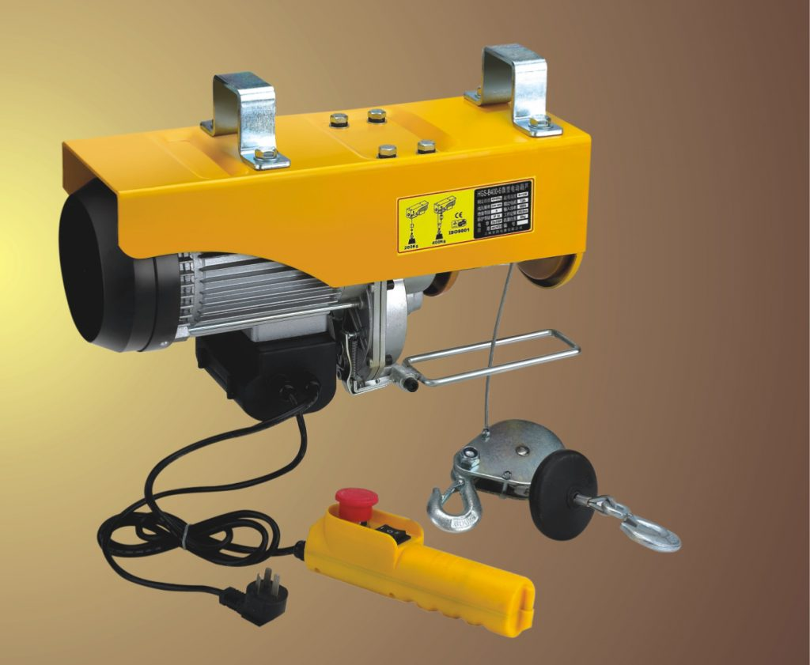
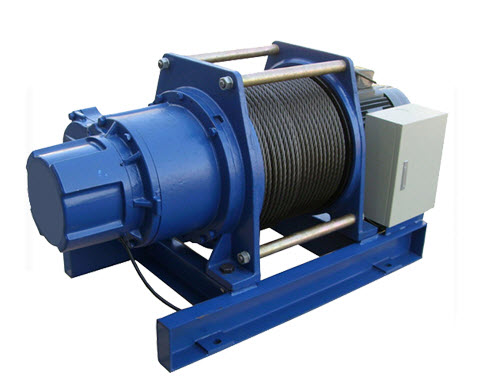

Là một trong số những thiết bị cần phải được kiểm định chặt chẽ để đảm bảo an toàn, Tời nâng hàng, tời điện với những ưu điểm của mình trong việc phục vụ cho hoạt động vận chuyển vật liệu cho các công trình xây dựng cần phải được kiểm định chặt chẽ.

### Tời nâng hàng, tời điện là gì?

Như đã nói qua ở trên, tời nâng hàng, tời điện là thiết bị chuyên dùng để chở nguyên vật liệu từ nơi này tới nơi khác nhằm phục vụ cho các công trình xây dựng dân dụng. Tời nâng hàng, tời điện có tốc độ nâng hàng khá nhanh, sử dụng nguồn điện sẵn có 220v. Và với đặc điểm là dùng motor riêng nên tời nâng hàng, tời điện có thể làm chủ được tốc độ nâng hàng.

Nhờ có tời nâng hàng, tời điện mà việc lắp đặt là tháo dỡ hàng háo được diễn ra nhanh chóng hơn bao giờ hết. Lý do là vì tời nâng hàng, tời điện có kích thước gọn nhỏ nhưng sức nâng hàng lớn, diện tích sử dụng nhỏ, và đặt ở dưới mặt đất một cách dễ dàng.

Việc kiểm định tời nâng hàng, tời điện là hoàn toàn cần thiết bởi vì hiện nay có khá nhiều sự cố đổ vỡ hàng hoá gây thiệt hại cho doanh nghiệp và làm nguy hại đến người lao động mà nguyên nhân liên quan đến thiết bị tời nâng hàng, tời điện. Do đó, tời điện, tời nâng hàng phải được kiểm định an toàn thường xuyên theo định kỳ để tránh những tai nạn đáng tiếc xảy ra.

### Tham khảo bảng giá kiểm định tời nâng hàng, tời điện

 - Tải trọng đến 1.0 tấn và góc nâng từ 0-35 độ: 1.800.000

- Tải trọng trên 1.0 tấn và góc nâng từ 35 đến 90 độ: 2.000.000

- Cáp treo vận chuyển người: 20.000/m

- Tời thủ công có tải trọng >1 tấn: 1.000.000

Công ty cổ phần kiểm định đo lường và huấn luyện an toàn Việt Nam có đội  ngũ cán bộ kỹ thuật dày dặn kinh nghiệm và được đào tạo nâng cao trình độ thường xuyên sẽ đem đến dịch vụ kiểm định tời nâng hàng với tiêu chí An toàn – Chính xác – Kịp thời.

Chúng tôi luôn tạo sự tin cậy cho Khách hàng & Đối tác bằng uy tín cùng dịch vụ chuyên nghiệp. Hãy liên hệ ngay với chúng tôi để được tư vấn kiểm định tời nâng hàng, tời điện!