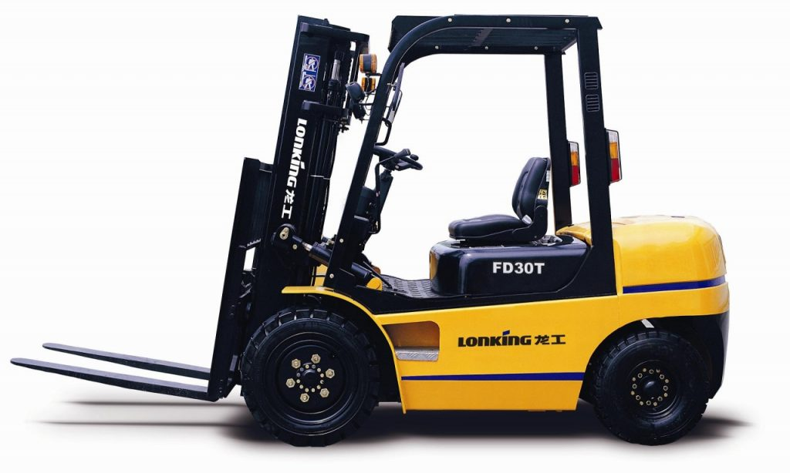
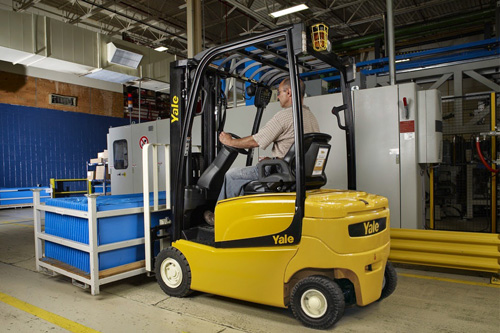

Là một trong những thiết bị bắt buộc phải được kiểm định an toàn trước khi đưa vào sử dụng, xe nâng thuộc nhóm thiết bị nâng hạ cần được kiểm tra chặt chẽ về độ an toàn bởi trong quá trình làm việc, nâng hạ rồi di chuyển hàng hoá, xe nâng dễ gây ra tai tạn và làm ảnh hưởng đến xung quanh nên cần phải được kiểm định.

Trên thực tế cũng có khá nhiều trường hợp xảy ra những trường hợp rất đáng tiếc mà nguyên nhân gây ra bắt nguồn từ việc tính toán, sử dụng và điều khiển các thiết bị nâng hạ sai mục đích kèm theo đó là việc thực hiện sai quy chuẩn làm xảy ra tình trạng rơi, đổ vỡ hàng hoá. Cũng có khi là do sự cố về độ bền của dây cáp, dây xích và phanh hãm không đảm bảo hoặc việc cố định vật nâng sai quy cách.

Chính vì thế, việc tiến hành kiểm định an toàn xe nâng chính là việc bắt buộc đối với bất kỳ chủ sở hữu cá nhân hay tổ chức nào có sử dụng thiết bị này. Công ty Kiểm định an toàn 24h là công ty chuyên cung cấp dịch vụ kiểm định xe nâng, thiết bị nâng với tiêu chí NHANH - CHÍNH XÁC - GIÁ THÀNH HỢP LÝ.

###Kiểm định an toàn xe nâng, thiết bị nâng có thời hạn bao lâu?

Mỗi thiết bị nâng, xe nâng được tiến hành kiểm định an toàn sẽ có thời hạn kiểm định lần đầu không quá 3 năm (tức là kiểm định đối với xe nâng, thiết bị nâng mới được mua về và chưa một lần sử dụng). Sau khi kiểm định lần đầu đạt yêu cầu thì sẽ tiến hành kiểm định định kỳ và thời hạn sẽ là 1 năm hoặc 6 tháng, cũng là thời hạn đó đối với kiểm định xe nâng đã qua sử dụng.

###Kiểm định xe nâng, thiết bị nâng trải qua quy trình như thế nào?

Quy trình kiểm định xe nâng, thiết bị nâng như sau:

- Đầu tiên phải kiểm tra bên ngoài: Có nghĩa là dùng mắt thường để xem xét xem xe nâng, thiết bị nâng mới hay cũ, bánh xe có bị mòn và mòn có đều không; các phớt của xilanh nâng hạ khung động, xilanh nghiêng khung… có bị chảy dầu hay không; gương chiếu hậu , còi, đèn còn không; càng nâng có bị mòn, biến dạng, nứt hay không...
- Sau đó mới tiến hành kiểm tra về kỹ thuật: Tức là các cán bộ kiểm định có chuyên môn kỹ thuật sẽ sử dụng các máy móc thiết bị chuyên dùng để kiểm tra như như máy đo khoảng cách, thước kép, thước kéo, rồi tiến hành thử tải hàng hoá...

###Các hình thức kiểm định xe nâng, thiết bị nâng bao gồm những gì?

Như đã nói qua một chút ở trên, các hình thức kiểm định xe nâng bao gồm:

- Kiểm định xe nâng, thiết bị nâng lần đầu: đó là hình thức kiểm định khi xe nâng, thiết bị nâng mới vừa xuất xưởng hoặc nhập về, chưa qua sử dụng lần nào. Công đoạn kiểm định lần đầu khá vất vả vì phải lập hồ sơ kỹ thuật cho xe, đo đạc các kích thước, vẽ hình...
- Kiểm định xe nâng, thiết bị nâng định kỳ: đó là hình thức kiểm định được tiến hành khi hết thời hạn kiểm định lần đầu. Và thường thì việc kiểm định định kỳ này dễ chịu hơn vì sẽ dựa vào các thông số của lần kiểm định trước đó để làm cơ sở đánh giá.
- Kiểm định xe nâng bất thường : Là hình thức kiểm định được tiến hành khi thực hiện việc vận chuyển thiết bị nâng từ nơi này đến nơi khác và có sự tháo lắp một vài bộ phận, hoặc có sự sửa chữa khắc phục sự cố lớn nào đó. Hình thức kiểm định bất thường này có thể tiến hành ngay cả khi kiểm định lần đầu hoặc định kỳ còn hiệu lực.

###TIÊU CHUẨN KIỂM ĐỊNH XE NÂNG

- TCVN 4244-2005: Thiết bị nâng thiết kế, chế tạo và kiểm tra kỹ thuật.
- TCVN 5206-1990: Máy nâng hạ- Yêu cầu an toàn đối với đối trọng và ổn trọng.
- TCVN 4755-1989: Cần trục- Yêu cầu an toàn đối với các thiết bị thuỷ lực.
- TCVN 5209-1990: Máy nâng hạ – Yêu cầu an toàn đối với thiết bị điện.
- TCVN 5179-90: Máy nâng hạ- Yêu cầu thử thuỷ lực về an toàn.
- TCVN 5207-1990: Máy nâng hạ – Yêu cầu an toàn chung.

Với kinh nghiệm có được cùng với trình độ chuyên môn được công nhận, Công ty cổ phần kiểm định đo lường và huấn luyện an toàn Việt Nam chính là sự lựa chọn tốt nhất đem lại dịch vụ chất lượng nhất cho bạn. Còn chần chừ gì nữa, hãy liên hệ ngay cho chúng tôi để có được một quy trình kiểm định xe nâng, thiết bị nâng đảm bảo nhất.

Công ty cổ phần kiểm định đo lường và huấn luyện an toàn Việt Nam

Trụ sở chính: .................

Văn phòng giao dịch: .................

Điện thoại: 0984.126.797 (Mr. Tùng)

Email: kiemdinh247@gmail.com