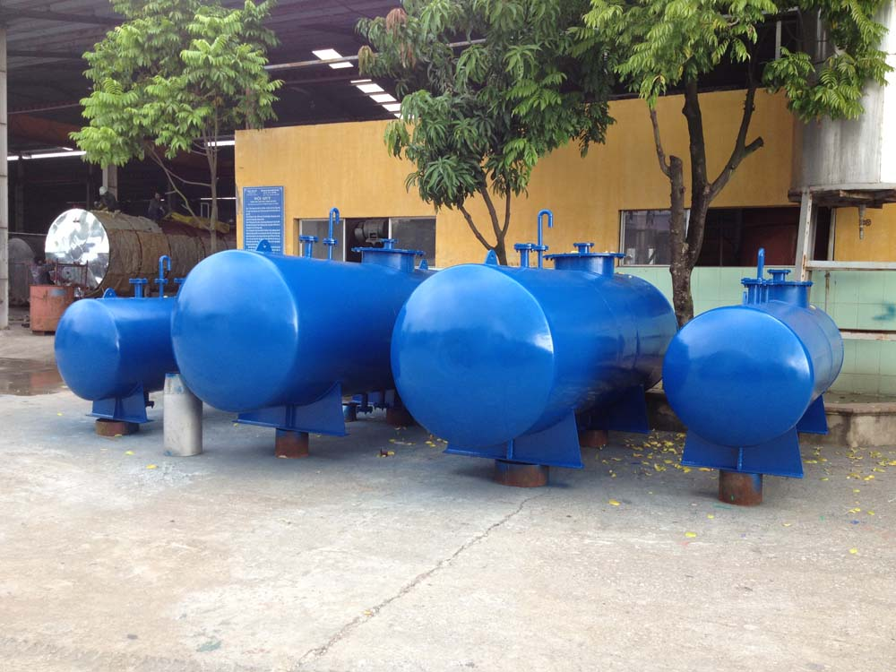
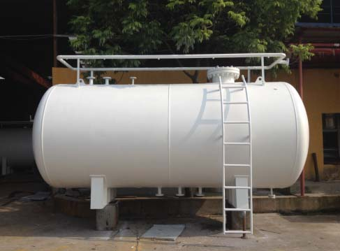

Kiểm định bể, bồn, thiết bị chứa là quy định bắt buộc phải thực hiện nhằm đảm bảo an toàn lao động khi sử dụng trong hoạt động sản xuất. Các bể, bồn chứa hiện nay được sử dụng khá phổ biến  và cần phải được tiến hành kiểm định nhằm đảm bảo chất lượng.

### Bể, bồn, thiết bị chứa là gì?
Các bể, bồn, thiết bị chứa là thiết bị dùng để tồn chứa các loại chất lỏng với khối lượng lớn được dùng khá phổ biến hiện nay. Hầu hết các bể, bồn chứa được dùng để chứa đựng các sản phẩm dầu khí như xăng, dầu, LPG, LNG, nhựa đường, các sản phẩm nông nghiệp như dầu ăn, mật mía, cồn; các sản phẩm thực phẩm khác như bia, rượu, nước tinh lọc.

Về kỹ thuật, có thể nói bể (xi téc) và thùng dùng để chứa, chuyên chở khí hoá lỏng hoặc các chất lỏng có áp suất làm việc cao hơn 0,7 bar hoặc chất lỏng hay chất rắn dạng bột không có áp suất nhưng khi tháo ra dùng khí có áp suất cao hơn 0,7 bar (theo phân loại tại Tiêu chuẩn Việt Nam TCVN 6153: 1996)

Hiện nay, để đánh giá chất lượng và tuổi thọ của bồn chứa – Viện dầu khí Mỹ (API) đã đưa ra tiêu chuẩn và hướng dẫn thực hiện kiểm định, sửa chữa, mở rộng và xây dựng & hoán cải bồn chứa.

Cụ thể như : API 653: Là tiêu chuẩn cho bồn chứa xăng dầu cao hơn 15m hoặc có đường kính lớn hơn 10m bao gồm các hướng dẫn cho việc duy trì, kiểm tra, thay đổi và sửa chữa bồn thép, bể chứa trên mặt đất dựng đứng được xây dựng theo tiêu chuẩn API 650 hoặc tiêu chuẩn API 12C.

### Quy trình kiểm định bể, bồn, thiết bị chứa theo tiêu chuẩn API 653 được tiến hành như sau:

- Xem xét tài liệu, thu thập thông tin chung của bồn chứa: Bản vẽ thiết kế, thông số kỹ thuật, hiện trạng, hoạt động bảo trì và sửa chữa bồn
- Kiểm tra tình trạng bằng trực quan của than bồn, mái, các đường hàn, sơn phủ, móng bồn
- Kiểm tra chiều dày tôn của đáy, thân bồn và mái bồn: Đo độ dày tôn bằng máy siêu âm, đánh giá tốc độ ăn mòn.
- Kiểm tra rò rỉ của đáy bồn bằng phương pháp hút chân không
- Kiểm tra độ lún của bồn chứa: Kiểm tra hiện trạng nghiêng, góc cạnh lún bằng máy toàn đạc điện tử laser
- Đánh giá thời gian sử dụng còn lại của bồn
- Đề xuất chu kỳ kiểm định tiếp theo

Dịch vụ kiểm định bể, bồn, thiết bị chứa theo tiêu chuẩn API 653 của Công ty cổ phần kiểm định đo lường và huấn luyện an toàn Việt Nam được thực hiện bởi các kiểm định viên có kinh nghiệm lâu năm và thường xuyên được đào tạo nâng cao trình độ chuyên môn. Chúng tôi tự tin là đơn vị dẫn đầu trong việc thực hiện dịch vụ kiểm định bể, bôn, thiết bị chứa đảm bảo chất lượng theo tiêu chuẩn.

Để yêu cầu dịch vụ Kiểm định bồn chứa theo API 653 - Hãy liên hệ ngay với Công ty cổ phần kiểm định đo lường và huấn luyện an toàn Việt Nam và nhận được những tư vấn hữu ích cùng với dịch vụ tốt nhất.