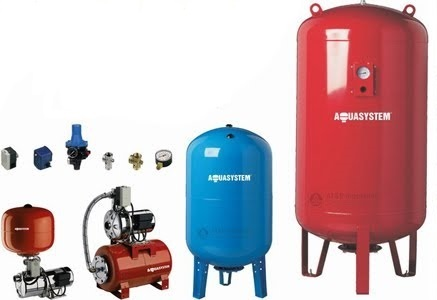
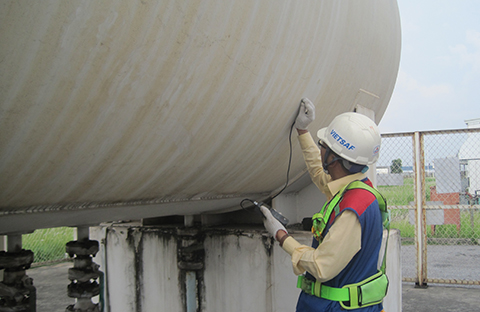

Các máy móc thiết bị được sử dụng cho các dự án xây dựng, kỹ thuật luôn tiềm ẩn nhiều nguy cơ gây tai nạn cho người lao động, vì vậy, chúng cần phải đảm bảo được những yêu cầu nghiêm ngặt về an toàn lao động để không có cơ hội cướp đi sinh mạng con người hay gây thiệt hại về tài sản, ảnh hưởng đến môi trường. Trong các thiết bị bắt buộc phải được kiểm định an toàn thì bao gồm cả Bình chịu áp lực.

Nói đến bình chịu áp lực, chúng ta có thể hiểu đây là một thiết bị dùng để thực hiện các quá trình nhiệt học hoặc hóa học, đồng thời bình chịu áp lực cũng để chứa và chuyên chở môi chất có áp suất lớn hơn áp suất khí quyển. Trong thông tư 07/2014/TT-BLĐTBXH có ghi rõ về quy định kiểm định an toàn bình chịu áp lực và có nói rõ rằng bình chịu áp lực có áp suất làm việc cao hơn 0,7 bar không kể áp suất thủy tĩnh (theo QCVN 01-2008/BLĐTBXH) thì bắt buộc phải kiểm định an toàn.

Cũng như các thiết bị cần được kiểm định khác, bình chịu áp lực cũng phải được thực hiện các hình thức kiểm định kỹ thuật an toàn lần đầu, kỹ thuật an toàn định kỳ và kiểm định kỹ thuật an toàn bất thường đối với các bình chịu áp lực có áp suất làm việc cao hơn 0,7 bar không kể áp suất thủy tĩnh (theo QCVN 01-2008/BLĐTBXH), nằm trong Danh mục những loại máy móc, thiết bị, vật tư có yêu cầu nghiêm ngặt về an toàn lao động do Bộ Lao động - Thương binh và Xã hội ban hành.

####Chi phí kiểm định bình chịu áp lực tham khảo

- Dung tích đến 02 m3: 500.000
- Dung tích trên 02 m3 đến 10 m3: 800.000
- Dung tích trên 10 m3 đến 25 m3: 1.200.000
- Dung tích trên 25 m3 đến 50 m3: 1.500.000
- Dung tích trên 50 m3 đến 100 m3: 4.000.000
- Dung tích trên 100 m3 đến 500 m3: 6.000.000
- Dung tích trên 500 m3: 7.500.000

Công ty cổ phần kiểm định đo lường và huấn luyện an toàn Việt Nam là đơn vị chuyên triển khai các dịch vụ kiểm định bình chịu áp lực với sự tham gia của đội ngũ cán bộ nhân viên kiểm định có kinh nghiệm và liên tục được đào tạo nâng cao trình độ. Sử dụng dịch vụ của chúng tôi, Quý khách sẽ luôn nhận được sự phục vụ tận tình và chu đáo nhất, đem lại kết quả kiểm định đảm bảo chất  lượng nhất có thể.

Mọi thắc mắc và vấn đề cần được tư vấn Quý khách vui lòng liên hệ với chúng tôi theo :

CÔNG TY: Công ty cổ phần kiểm định đo lường và huấn luyện an toàn Việt Nam

Trụ sở chính: .................

Văn phòng giao dịch: .................

Điện thoại: 0984.126.797 (Mr. Tùng)

Email: kiemdinh247@gmail.com