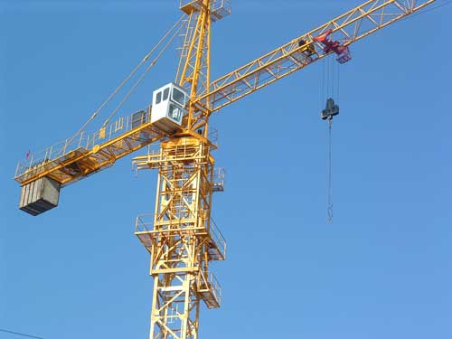

Cần trục tháp và cẩu tháp là một trong số những thiết bị cần được kiểm định chặt chẽ trước khi đưa vào sử dụng và cần phải được kiểm định định kỳ để đảm bảo sự an toàn khi vận hành thi công xây dựng.

### Tìm hiểu về cần trục tháp, cẩu tháp?

Cầu trục tháp  là thiếi bị được sử dụng phổ biến trong các công trình xây dựng nhà cao tầng, trụ cầu lớn hay các công trình thuỷ điện. Cầu trục tháp còn được gọi là cẩu tháp, dùng để vận chuyển vật liệu xây dựng và các cấu kiện xây dựng lên cao, lắp ráp các cấu kiện trong các công trình xây dựng có độ cao khá lớn, với khối lượng công việc nhiều và thời gian thực hiện thi công dài ngày.

Cần trục tháp là loại cần trục quay, có cần lắp với phần đỉnh tháp cố định hay di chuyển

### Phân loại cần trục tháp

- Dựa vào đặc điểm của thân tháp, sẽ có :
	- Cần trục tháp có thân tháp quay
	- Cần trục tháp có đầu tháp quay còn thân tháp không quay

- Dựa vào dạng cần, sẽ có :
	- Cần trục tháp có cần nâng hạ
	- Cần trục tháp có cần đặt nằm ngang

- Dựa vào khả năng di chuyển, sẽ có :
	- Cần trục tháp đặt cố định
	- Cần trục tháp di chuyển trên ray

- Dựa vào khả năng thay đổi độ cao, sẽ có :
	- Cần trục tháp tự nâng, tăng dần độ cao bằng cách nối dài thêm thân tháp.
	- Cần trục tháp tự leo, cần trục leo dần lên cao theo sự phát triển độ cao của công trình.
	- Cần trục tháp không thay đổi được độ cao.

### Kiểm định cần trục tháp - cầu tháp được tiến hành theo quy trình như thế nào?

Cũng tương tự như một số thiết bị cần được kiểm định như thang máy, thang cuốn, vận thăng.... kiểm định cần trục tháp - cầu tháp được tiến hành lần lượt các bước :

**1.1. Kiểm tra bên ngoài:**

1.1.1. Kiểm tra vị trí lắp đặt thiết bị, hệ thống điện, bảng hướng dẫn nội quy sử dụng, hàng rào bảo vệ, mặt bằng, khoảng cách và các biện pháp an toàn, các chướng ngại vật cần l¬ưu ý trong suốt quá trình tiến hành kiểm định; sự phù hợp của các bộ phận, chi tiết và thông số kỹ thuật của thiết bị so với hồ sơ, lý lịch.

1.1.2. Xem xét lần lượt và toàn bộ các cơ cấu, bộ phận của thiết bị nâng, đặc biệt chú trọng đến tình trạng các bộ phận và chi tiết sau:

- Kết cấu kim loại của thiết bị nâng, các mối hàn, mối ghép đinh tán (nếu có), mối ghép bulông của kết cấu kim loại, buồng điều khiển, thang, sàn và che chắn;

- Móc và các chi tiết của ổ móc (Phụ lục 13A,13B,13C TCVN 4244: 2005);

- Cáp và các bộ phận cố định cáp (Đáp ứng yêu cầu của nhà chế tạo hoặc tham khảo Phụ lục 11C, 21 TCVN 4244 : 2005);

- Puly, trục và các chi tiết cố định trục ròng rọc (Phụ lục 19A, 20A, 20B TCVN 4244 : 2005);

- Đường ray (Phụ lục 5 TCVN 4244 : 2005);

- Các thiết bị an toàn (hạn chế chiều cao nâng, hạ; hạn chế di chuyển xe con, máy trục);

- Kiểm tra điện trở nối đất không được quá 4,0Ω , điện trở cách điện của động cơ điện không dưới 0,5 MΩ (điện áp thử 500V);

- Các phanh phải kiểm tra theo quy định tại mục 1.5.3.3 TCVN 4244:2005.

--> Đánh giá : Kết quả kiểm định đạt yêu cầu khi thiết bị được lắp đặt theo đúng hồ sơ kỹ thuật, không phát hiện các hư hỏng, khuyết tật thiết bị và đáp ứng các yêu cầu của mục 1.1.

**1.2. Kiểm tra kỹ thuật - Thử không tải**

- Tiến hành thử không tải các cơ cấu và thiết bị, bao gồm: tất cả các cơ cấu và trang bị điện, các thiết bị an toàn, phanh, hãm và các thiết bị điều khiển, chiếu sáng, tín hiệu, âm hiệu;

- Các phép thử trên được thực hiện không ít hơn 03 (ba) lần.

--> Đánh giá: Kết quả đạt yêu cầu khi các cơ cấu và thiết bị an toàn của thiết bị khi thử hoạt động đúng thông số và tính năng thiết kế.

**1.3. Các chế độ thử tải - Phương pháp thử**

1.3.1. Thử tải tĩnh:

- Thử tải tĩnh thiết bị nâng dạng cầu phải tiến hành với tải thử 125% (mục 4.3.2 - TCVN 4244 : 2005) trọng tải thiết kế hoặc trọng tải do đơn vị sử dụng yêu cầu (trọng tải do đơn vị sử dụng yêu cầu phải nhỏ hơn tải trọng thiết kế) và phải phù hợp với chất lượng thực tế  của thiết bị;

- Thử tải tĩnh thiết bị nâng dạng cầu được thực hiện theo mục 4.3.2- TCVN 4244: 2005.

--> Đánh giá: Kết quả đạt yêu cầu khi trong 10 (mười) phút treo tải, tải không trôi, sau khi hạ tải xuống, các cơ cấu và bộ phận của thiết bị không có vết nứt, không có biến dạng dư hoặc các hư hỏng khác (mục 4.3.2- TCVN 4244 : 2005).

1.3.2. Thử tải động:

- Thử tải động thiết bị nâng phải tiến hành với tải thử 110% trọng tải thiết kế hoặc trọng tải do đơn vị sử dụng đề nghị (mục 4.3.2- TCVN 4244: 2005), tiến hành nâng và hạ tải đó ba lần và phải kiểm tra hoạt động của tất cả các cơ cấu khác ứng với tải đó;

- Thử tải động thiết bị nâng căn cứ vào loại thiết bị và được thực hiện theo các mục 4.3.2- TCVN 4244:2005.

--> Đánh giá: Kết quả đạt yêu cầu khi các cơ cấu và bộ phận của thiết bị hoạt động đúng tính năng thiết kế và các yêu cầu của các Tiêu chuẩn kỹ thuật an toàn hiện hành, không có vết nứt, không có biến dạng hoặc các hư hỏng khác.

1.3.3. Đối với thiết bị nâng hoạt động trong môi trường đặc biệt:

1.3.3.1. Những thiết bị nâng chỉ dùng để nâng hạ tải (nâng cửa ống thủy lợi, cửa ống thủy điện) thì:

- Thử tải tĩnh theo 1.3.1;

- Có thể thử tải động với tải trọng bằng 110% trọng tải thiết kế hoặc trọng tải do đơn vị sử dụng đề nghị (mục 4.3.2- TCVN 4244: 2005) khi không di chuyển thiết bị và xe con. Tiến hành nâng và hạ tải đó ba lần và phải kiểm tra hoạt động của các cơ cấu nâng, hạ ứng với tải đó.

--> Đánh giá:  Kết quả đạt yêu cầu khi các cơ cấu và bộ phận của thiết bị hoạt động đúng tính năng thiết kế và các yêu cầu của các Tiêu chuẩn kỹ thuật an toàn hiện hành, không có vết nứt, không có biến dạng dư hoặc các hư hỏng khác.

1.3.3.2. Khi thử tải tĩnh và thử tải động những cầu trục phục vụ các nhà máy nhiệt điện, thủy điện, trạm thủy lợi cho phép sử dụng thiết bị chuyên dùng để tạo tải trọng thử mà không cần dùng tải (thông thường dùng các xy lanh - pít tông thủy lực để tạo tải trọng thử).

Trường hợp này cơ sở sử dụng hoặc nhà cung cấp, lắp đặt thiết bị phải lập quy trình vận hành thiết bị tạo tải trọng thử và phải được xác nhận giữa các bên liên quan. Tất cả các thiết bị đo lường, bảo vệ liên động và an toàn của thiết bị tạo tải trọng thử phải được kiểm tra theo đúng quy định.

- Thử tải tĩnh theo 1.3.1;

- Thử tải động với tải thử 110% trọng tải thiết kế hoặc trọng tải do đơn vị sử dụng đề nghị phải được tiến hành không ít hơn 01(một) vòng quanh tang. Tiến hành nâng và hạ tải đó ba lần và phải kiểm tra hoạt động của các cơ cấu nâng, hạ ứng với tải đó.

--> Đánh giá: Kết quả đạt yêu cầu khi các cơ cấu và bộ phận của thiết bị hoạt động đúng tính năng thiết kế và các yêu cầu của các Tiêu chuẩn kỹ thuật an toàn hiện hành, không có vết nứt, không có biến dạng hư hoặc các hư hỏng khác.

Công ty cổ phần kiểm định đo lường và huấn luyện an toàn Việt Nam với đội ngũ cán bộ kiểm định viên có kinh nghiệm và liên tục được đào tạo để nâng cao trình độ chuyên môn sẽ mang đến dịch vụ kiểm định cần trục tháp, kiểm định cẩu tháp với tiêu chí An toàn – Chính xác – Kịp thời.

Chúng tôi luôn tạo sự tin cậy cho Khách hàng & Đối tác bằng uy tín cùng dịch vụ chuyên nghiệp. Hãy liên hệ ngay với chúng tôi để được tư vấn kiểm định cần trục tháp, cẩu tháp!