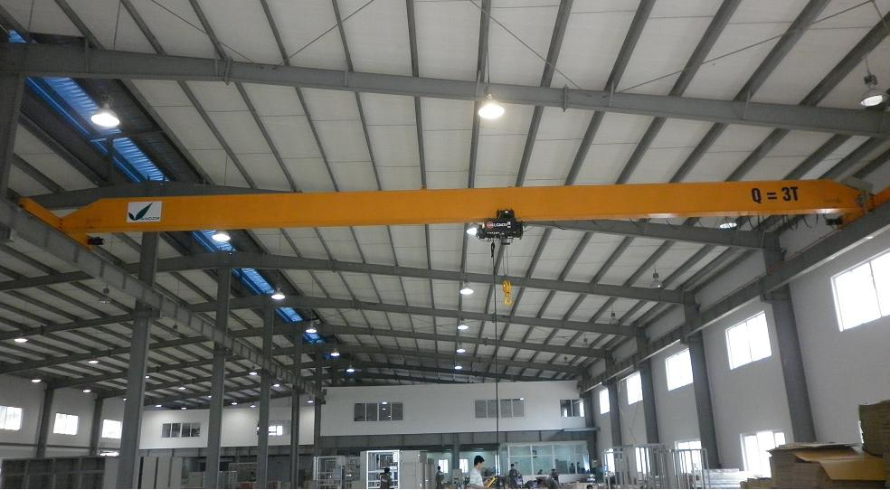
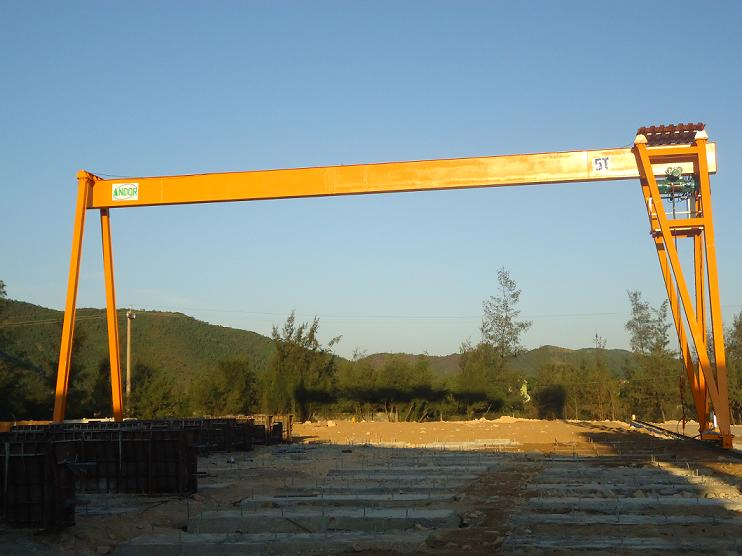

Nằm trong danh mục các thiết bị cần phải được kiểm định theo thông tư 32 của bộ LĐ-TBXH, cầu trục, cổng trục là thiết bị nâng hạ cần phải kiểm định nghiêm ngặt hơn bao giờ hết.

### Cầu trục - Cổng trục là gì?

Là một trong những thiết bị nâng hạ quan trọng, có khả năng di chuyển trong phạm vi hoạt động của thiết bị (cơ động cao), trong ngành công nghiệp thì thiết bị cẩu trục đóng vai trò rất quan trọng trong việc rút ngắn thời gian sản xuất, bốc xếp, nâng hạ tăng cao hiệu quả kinh tế.

Cầu trục - cổng trục đều cần phải được đảm bảo an toàn nghiêm ngặt mới được đưa vào sử dụng, do vậy việc tiến hành kiểm định cầu trục - cổng trục là điều bắt buộc phải thực hiện.

Theo quy định tại Thông tư 32 của Bộ LĐ-TB&XH, việc kiểm định cẩu trục kiểm định an toàn cẩu trục phải được tiến hành định kỳ hàng năm ( bao gồm kiểm định lần đầu cẩu trục và kiểm định định kỳ cẩu trục ). Đơn vị thực hiện kiểm dinh cẩu trục phải có chức năng pháp lý kiểm định cẩu trục, kiểm định cổng trục.

### Lý do phải kiểm định cầu trục, cổng trục là gì?

- Đây là thiết bị có yêu cầu nghiêm ngặt về an toàn lao động và vệ sinh lao động, cần phải được kiểm định theo quy định của pháp luật.
- Kiểm định cầu trục, cổng trục để đảm bảo an toàn cho người cũng như tránh thiệt hại về cơ sở vật chất cho doanh nghiệp.
- Qua công tác kiểm định sẽ nhanh chóng phát hiện được các hư hỏng, cần phải khắc phục, từ đó nâng cao được nâng suất làm việc của cầu trục

### Tham khảo chi phí kiểm định cầu trục, cổng trục

- Tải trọng dưới 3,0 tấn: 700.000

- Tải trọng từ 3,0 tấn đến 7,5 tấn: 1.200.000

- Tải trọng trên 7,5 tấn đến 15 tấn: 2.200.000

- Tải trọng trên 15 tấn đến 30 tấn: 3.000.000

- Tải trọng trên 30 tấn đến 75 tấn: 4.000.000

- Tải trọng từ 75 tấn đến 100 tấn: 5.000.000

- Tải trọng trên 100 tấn: 6.000.000

Công ty cổ phần kiểm định đo lường và huấn luyện an toàn Việt Nam với đội ngũ nhân viên kỹ thuật có kinh nghiệm và luôn được đào tạo nâng cao trình độ chuyên môn sẽ mang đến cho Quý khách dịch vụ kiểm định cầu trục, cổng trục đảm bảo chính xác, an toàn, chất lượng nhất.

Chúng tôi luôn tạo sự tin cậy cho Khách hàng & Đối tác bằng uy tín cùng dịch vụ chuyên nghiệp. Hãy liên hệ ngay với chúng tôi để được tư vấn kiểm định cầu trục, cổng trục!
