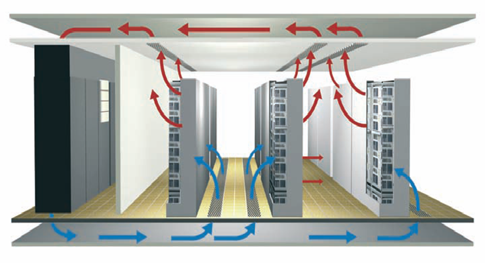
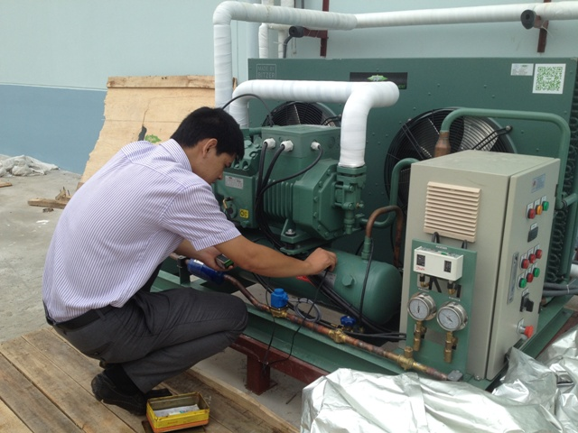

Hệ thống lạnh là một trong số những danh mục bắt buộc phải được kiểm định an toàn theo Thông tư 07/2014/TT-BLĐTBXH đã quy định. Dịch vụ kiểm định hệ thống lạnh của công ty kiểm định an toàn 24h luôn đảm bảo tiến độ Nhanh, an toàn, chính xác với mức giá hợp lý nhất hiện nay.

### Hệ thống lạnh là gì?
Về cơ bản, hệ thống lạnh là một hệ thống truyền nhiệt, nó tản nhiệt từ nơi có nhiệt độ thấp đến nơi có nhiệt độ cao tức là di chuyển nhiệt độ từ nguồn nhiệt đến nơi thoát nhiệt. Sự hoạt động này nó có phần đối ngược với truyền nhiệt trong tự nhiên. Một số vùng ơở nước ta có khí hậu nóng quanh năm giống như miền Nam thì máy lạnh chỉ bơm nhiệt theo một chiều duy nhất là từ trong nhà ra ngoài trời. Nhưng miền Bắc thì máy lạnh bơm nhiệt theo hai chiều. Vào mùa hè bơm nhiệt từ trong nhà ra ngoài trời, mùa đông thì bơm nhiệt từ ngoài trời vào trong nhà.

Hệ thống lạnh các loại (theo phân loại tại Tiêu chuẩn Việt Nam TCVN 6104: 1996), trừ hệ thống lạnh có môi chất làm việc bằng nước, không khí; hệ thống lạnh có lượng môi chất nạp vào nhỏ hơn 5 kg đối với môi chất làm lạnh thuộc nhóm 1, nhỏ hơn 2,5 kg đối với môi chất lạnh thuộc nhóm 2, không giới hạn lượng môi chất nạp đối với môi chất lạnh thuộc nhóm 3;

Hệ thống lạnh tổ hợp các bộ phận chứa môi chất làm lạnh được nối với nhau tạo thành vòng tuần hoàn lạnh kín trong đó môi chất làm lạnh được lưu thông để hấp thụ và thải nhiệt.

### Hình thức kiểm định hệ thống lạnh

Cũng giống như các thiết bị cần được kiểm định khác, hình thức kiểm định hệ thống lạnh cũng là hoạt động đánh giá tình trạng kỹ thuật an toàn của hệ thống lạnh theo các quy chuẩn kỹ thuật quốc gia, tiêu chuẩn kỹ thuật an toàn, bao gồm :

- Kiểm định hệ thống lạnh lần đầu : thực hiện sau khi lắp đặt hệ thống lạnh và trước khi đưa hệ thống lạnh vào sử dụng lần đầu.
- Kiểm định hệ thống lạnh định kỳ : được thực hiện khi thời hạn của lần kiểm định trước đó đã hết
- Kiểm định hệ thống lạnh bất thường : Được thực hiện khi gặp trường hợp quay trở lại sử dụng lại các hệ thống đã nghỉ hoạt động từ 12 tháng trở lên; hay thực hiện sau khi sửa chữa, nâng cấp, cải tạo có ảnh hưởng tới tình trạng kỹ thuật an toàn của hệ thống; hoặc sau khi thay đổi vị trí lắp đặt; hay khi có yêu cầu kiểm định của cơ sở hoặc cơ quan có thẩm quyền.

### Quy trình kiểm định hệ thống lạnh

Công tác kiểm định hệ thống lạnh cần phải được thực hiện đúng quy trình để đảm bảo chất lượng và có được đánh giá chính xác nhất, cụ thể là :

- Kiểm tra hồ sơ, lý lịch của hệ thống lạnh;

- Kiểm tra kỹ thuật bên ngoài, bên trong;

- Kiểm tra kỹ thuật thử nghiệm;

- Kiểm tra vận hành;

- Xử lý kết quả kiểm định.

**Chú ý**: Và đương nhiên là chỉ khi bước kiểm tra đầu tiên đạt yêu cầu thì mới được tiến hành các bước kiểm tra tiếp theo đối với hệ thống lạnh. Mọi kết quả kiểm tra đều đảm bảo phải được ghi lại đầy đủ vào bản ghi chép hiện trường theo mẫu qui định tại phụ lục 01 và lưu hồ sơ tại đơn vị tiến hành kiểm định hệ thống lạnh

### Chi phí tham khảo dịch vụ kiểm định hệ thống lạnh

- - Năng suất lạnh đến 30.000 Kcal/h: 1.400.000

- Năng suất lạnh trên 30.000 Kcal/h đến 100.000 Kcal/h: 2.500.000

- Năng suất lạnh trên 100.000 Kcal/h đến 1.000.000 Kcal/h: 4.000.000

- Năng suất lạnh trên 1.000.000 Kcal/h: 5.000.000

Pháp luật Việt Nam quy định rõ yêu cầu bắt buộc phải kiểm định an toàn hệ thống lạnh, do vậy, các đơn vị, cơ quan sử dụng thiết bị này cần phải tiến hành kiểm định theo đúng quy định trước khi đưa vào hoạt động.

Công ty cổ phần kiểm định đo lường và huấn luyện an toàn Việt Nam là đơn vị chuyên cung cấp dịch vụ kiểm định hệ thống lạnh Uy tín - Chuyên nghiệp hàng đầu Việt Nam hiện nay. Nếu Quý khách hàng có bất kỳ thắc mắc nào hoặc cần được tư vấn thêm vui lòng liên hệ với chúng tôi.