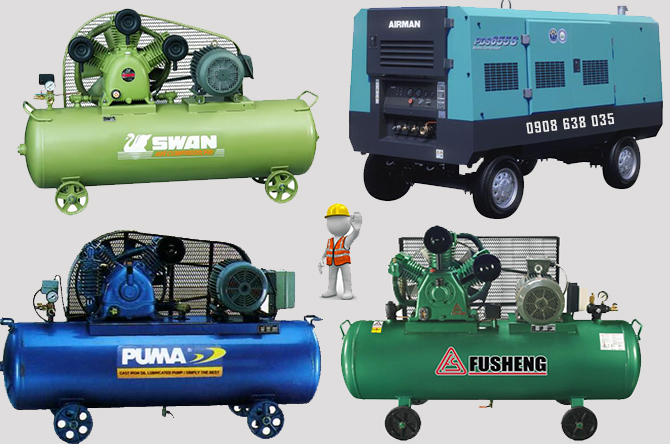
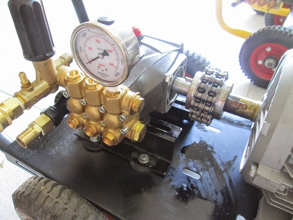

Máy nén khí nằm trong danh mục bình chịu áp lực cần được kiểm định chặt chẽ mới được sử dụng. Bởi môi chất làm việc của máy nén khí, bình nén khí là không khí nén, vậy nên khi bị nén ở áp suất cao sẽ khiến xảy ra hiện tượng nổ rất nguy hiểm.

### Máy nén khí là gì?

Máy nén khí là các máy móc (hệ thống cơ học) có chức năng làm tăng áp suất của chất khí. Máy nén khí được sử dụng khá phổ biến trong hầu hết các ngành công nghiệp bao gồm : in ấn, bao bì, thực phẩm, dệt, gỗ... Máy nén khí là một cầu nối không thể thiếu tại các hệ thống công nghiệp sử dụng khí ở áp suất cao nhằm dùng để vận hành các máy móc khác.

### Tại sao cần phải kiểm định máy nén, bình nén khí?
Máy nén khí, bình nén khí là một trong những thiết bị nằm trong danh mục bình chịu áp lực và môi chất làm việc của nó là không khí nén. Không khí nén ở áp suất cao có thể gây ra hiện tượng nổ khá nguy hiểm. Do vậy, ngoài kiểm định ban đầu thì định kỳ chúng ta phải tiến hành kiểm định máy nén khí để nắm được thực tế hoạt động của bình có còn đảm bảo an toàn hay không. Và trong quá trình kiểm định, khi nhận thấy bất cứ yếu tố nguy hiểm nào cũng sẽ phải tiến hành thủ tục loại bỏ thiết bị nhằm loại bỏ ảnh hưởng của nó đến quá trình hoạt động.

Theo đó, Quy định về việc kiểm định an toàn bình khí nén được nêu rõ tại mục 4 Thông tư 05/2014/TT-BLĐTBXH gày 6 tháng 3 năm 2014 của Bộ lao động – Thương binh và Xã hội: Các bình chịu áp lực có áp suất làm việc định mức cáo hơn 0,7bar (không kể áp suất thủy tĩnh) theo phân loại tại Tiêu chuẩn Việt Nam TCVN 8366:2010.

Do vậy, tất cả bình nén khí kể cả bình mới xuất xưởng hay bình đã qua sử dụng đều phải được kiểm định nghiêm ngặt xem có đảm bảo an toàn không mới được đưa vào sử dụng. Nếu hết hạn kiểm định thì đơn vị trực tiếp sử dụng thiết bị có trách nhiệm gọi đơn vị kiểm định xuống nơi đặt thiết bị để tiến hành kiểm định định kỳ tiếp theo.

Chi phí kiểm định bình khí nén được áp dụng vào mục bình chịu áp lực. Để hiểu rõ hơn, bạn nên tham khảo tại mục 2 của Thông tư 73/2014/TT-BTC. Nhưng tốt nhất quý khách hãy gọi trực tiếp hoặc gửi mail để được tư vấn với giá tốt nhất.

### Kiểm định máy nén khí có thời hạn trong bao lâu?

Thời hạn kiểm định kỹ thuật an toàn bình khí nén định kỳ là 03 năm. Đối với các bình chứa môi chất ăn mòn kim loại, cháy nổ và các bình đã qua sử dụng trên 12 năm thì thời hạn kiểm định kỹ thuật an toàn định kỳ là 02 năm
Đối với các bình chứa môi chất ăn mòn kim loại, cháy nổ đã qua sử dụng trên 12 năm và các bình đã qua sử dụngtrên 24 năm thì thời hạn kiểm định kỹ thuật an toàn bình khí nén là 01 năm
Trường hợp nhà sản xuất hoặc cơ sở yêu cầu thời hạn kiểm định ngắn hơn thì thực hiện theo quy định của nhà sản xuất và yêu cầu của cơ sở.

### Việc hoàn thành kiểm định máy nén khí diễn ra trong bao nhiêu lâu?

Vấn đề về thời gian hoàn thành kiểm định máy nén khí hoàn toàn phụ thuộc vào việc bàn bạc, trao đổi giữa đơn vị tiến hành kiểm định và đơn vị có nhu cầu thực hiện kiểm định máy nén khí. Tuy nhiên, Công ty kiểm định an toàn 24h chúng tôi sẽ cố gắng hết sức có thể để đảm bảo lợi ích và đáp ứng nhu cầu của quý khách.

### Kiểm định máy nén khí diễn ra theo quy trình như thế nào?

Cũng tương tự như quy trình kiểm định thiết bị chịu áp lực, quy trình kiểm định máy nén khí bao gồm:

- Kiểm tra kỹ thuật bên ngoài
- Kiểm tra kỹ thuật bên trong
- Kiểm tra kỹ thuật, thử nghiệm
- Kiểm tra vận hành
- Xử lý kết quả kiểm định

Công ty cổ phần kiểm định đo lường và huấn luyện an toàn Việt Nam là đơn vị cung cấp dịch vụ kiểm định bình khí nén với chi phí thấp nhất - thời hạn dài nhất. Nếu có bất kỳ thắc mắc hoặc cần được tư vấn về dịch vụ kiểm định máy nén khí, bình nén khí, Quý khách vui lòng liên hệ với chúng tôi.