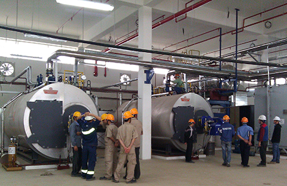

Nồi hơi và lò hơi là hai trong số những thiết bị nằm trong danh mục cần phải thực hiện yêu cầu nghiêm ngặt về kiểm định an toàn được Bộ LĐTB&XH ban hành. Kiểm định nồi hơi, lò hơi chính là cách thức hiệu quả nhất để đảm bảo an toàn cho người lao động nhằm hạn chế những tai nạn đáng tiếc có thể xảy ra và đồng thời cũng giúp giảm thiểu những thiệt hại không đáng có trong sản xuất của doanh nghiệp.

### Nồi hơi, lò hơi là gì?

Nồi hơi,lò hơi là các thiết bị như nồi hơi, lò hơi, lò nhiệt, đường dẫn nước nóng, nồi đun nước nóng có nhiệt độ môi chất trên 1150C được sử dụng rộng rãi phần lớn trong các ngành công nghệp, có vai trò đặc biệt quan trọng đối với việc tạo ra hơi nước cung cấp cho máy móc có thể hoạt đông được. Việc vận hành lò hơi yêu cầu nhiều tiêu chuẩn kỹ thuật quan trọng,vì thế công tác kiểm định lò hơi luôn phải được thực hiện một cách nghiêm ngặt.

Nồi hơi (bao gồm cả bộ quá nhiệt và bộ hâm nước) có áp suất làm việc định mức của hơi trên 0,7 bar (theo phân loại tại Tiêu chuẩn Việt Nam TCVN 6004: 1995).

Do làm việc ở mức áp suất lớn và nhiệt độ cao nên nếu có bất kỳ rủi ro nào xảy ra thì mức độ nguy hiểm của lò hơi là cực kỳ lớn. Nếu không tiến hành kiểm định an toàn nồi hơi, lò hơi để xảy ra tình trạng các thiết bị này không đảm bảo các điều kiện an toàn từ khâu thiết kế, chế tạo đến cả vận hành thì việc xảy ra những tai nạn lao động không đáng có là hoàn toàn có thể.

Công tác kiểm định nồi hơi, lò hơi sẽ giúp khắc phục những hư hỏng, từ đó có biện pháp bảo trì, sửa chữa để lò hơi vận hành tốt hơn, nâng cao năng suất làm việc trong quá trình lao động, sản xuất.

Có thể nói, Kiểm định nồi hơi, lò hơi là hạng mục bắt buộc cần phải thực hiện nhằm đảm bảo an toàn lao động cho người và hệ thống sản xuất của doanh nghiệp.

### Lúc nào cần tiến hành kiểm định kỹ thuật an toàn nồi hơi?

- Sau khi lắp đặt, trước khi đưa vào sử dụng

- Sau khi tiến hành cải tạo, sửa chữa lớn;

- Sau khi thiết bị xảy ra tai nạn, sự cố nghiêm trọng và đã khắc phục xong;

- Hết hạn kiểm định hoặc trước thời hạn theo đề nghị của cơ sở quản lý, sử dụng thiết bị nâng;

- Theo yêu cầu của cơ quan thanh tra nhà nước về lao động.

Thông thường, thời hạn kiểm định nồi hơi sẽ có thời gian tối đa khoảng 2 năm. Sau hai năm đó cần phải tiến hành kiểm định định kỳ nồi hơi để đảm bảo an toàn kỹ thuật.

### Tham khảo bảng giá kiểm định nồi hơi

- Công suất nhỏ hơn 01 tấn/giờ: 700.000

- Công suất từ 01 tấn/giờ - 02 tấn/giờ: 1.400.000

- Công suất trên 02 tấn/giờ - 06 tấn/giờ: 2.500.000

- Công suất trên 06 tấn/giờ - 10 tấn/giờ: 2.800.000

- Công suất trên 10 tấn/giờ - 15 tấn/giờ: 4.400.000

- Công suất trên 15 tấn/giờ - 25 tấn/giờ: 5.000.000

- Công suất trên 25 tấn/giờ - 50 tấn/giờ: 8.000.000

- Công suất trên 50 tấn/giờ - 75 tấn/giờ: 10.800.000

- Công suất trên 75 tấn/giờ - 125 tấn/giờ: 14.000.000

- Công suất trên 125 tấn/giờ - 200 tấn/giờ: 23.000.000

- Công suất trên 200 tấn/giờ - 400 tấn/giờ: 32.000.000

- Công suất trên 400 tấn/giờ: 39.000.000

Công ty cổ phần kiểm định đo lường và huấn luyện an toàn Việt Nam là đơn vị thực hiệndịch vụ kiểm định nồi hơi, lò hơi có uy tín với sự chuyên nghiệp về hình thức và công tác kiểm định hàng đầu Việt Nam hiện nay. Với đội ngũ cán bộ chuyên môn có kinh nghiệm, luôn được đào tạo để nâng cao trình độ sẽ hỗ trợ Quý khách có được kết quả kiểm định chính xác và đảm bảo nhất.