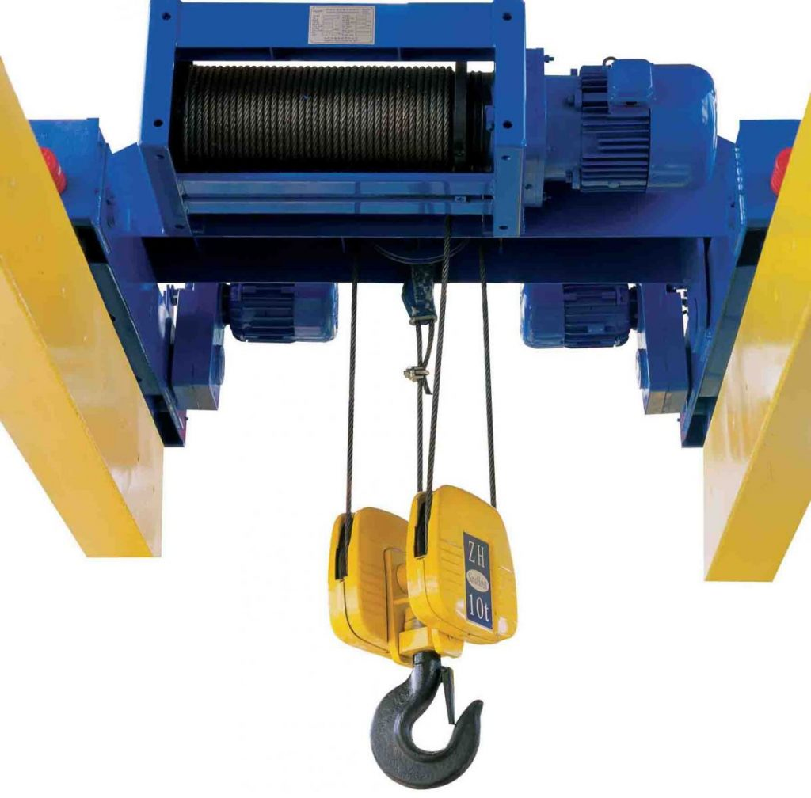
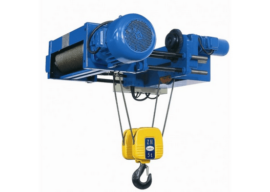

Theo quy định của Bộ Lao động thương binh và Xã hội, Pa lăng điện có tải trọng từ 1.000kg trở lên thuộc danh mục các thiết bị có yêu cầu nghiêm ngặt về an toàn lao động. Vì vậy, mọi đơn vị, tổ chức có sử dụng thiết bị nâng này cần phải kiểm định theo định kỳ.

Pa lăng là một loại thiết bị đảm bảo các thao tác nâng-hạ-di chuyển hàng hóa trong nhà xưởng. Nó rất tiện dụng và có hiệu quả cao trong quá trình bốc xếp hàng hóa, với sức nâng từ 1 đến 500 tấn, vận hành chủ yếu bằng các động cơ điện nên được dùng rộng rãi trong các nhà máy sản xuất công nghiệp.

### Pa lăng điện là gì?

Pa lăng điện là một tời điện có kết cấu gọn, các bộ phận động cơ điện, hộp giảm tốc và tang tời được bố trí thẳng hàng với tang tời ở giữa. Loại máy này thường được treo trên cao để nâng vật, và có thể có cơ cấu di chuyển trên một ray hoặc trên cánh dưới của dầm thép I đặt trên cao.

Pa lăng điện được có thể sử dụng độc lập để kéo vật hoặc dùng làm cơ cấu nâng của cần trục thiếu nhi, cầu trục.

### Quy trình kiểm định Pa lăng điện?

- Tiến hành kiểm tra bên ngoài, kiểm tra bên trong

- Tiến hành thử tải và vận hành thử

- Pa lăng điện thì tiến hành kiểm tra động cơ và tải thử

### Tham khảo chi phí kiểm định Pa lăng điện

- Tải trọng từ 1,0 tấn đến 3,0 tấn: 750.000

- Tải trọng trên 3,0 tấn đến 7,5 tấn: 1.300.000

- Tải trọng trên 7,5 tấn: 1.800.000

Công ty cổ phần kiểm định đo lường và huấn luyện an toàn Việt Nam với đội ngũ cán bộ nhân viên kiểm định có kinh nghiệm và được đào tạo thường xuyên nâng cao trình độ sẽ cung cấp dịch vụ kiểm định pa lăng xích, kiểm định pa lăng điện với tiêu chí An toàn – Chính xác – Kịp thời.

Chúng tôi luôn tạo sự tin cậy cho Khách hàng & Đối tác bằng uy tín cùng dịch vụ chuyên nghiệp. Hãy liên hệ ngay với chúng tôi để được tư vấn kiểm định pa lăng xích, kiểm định pa lăng điện.
