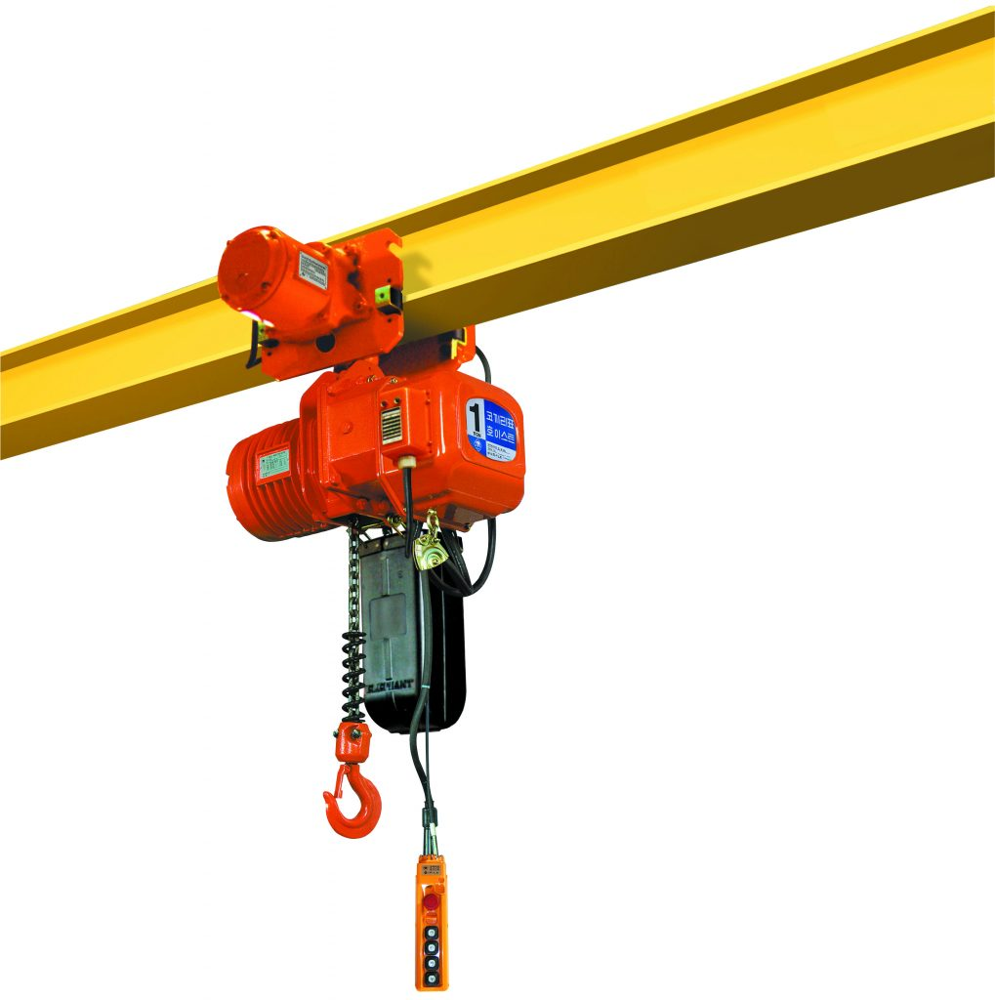
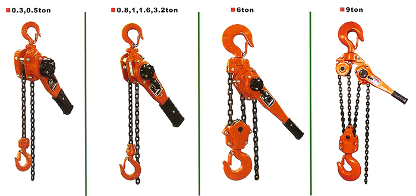

Pa lăng là thiết bị dùng để hỗ trợ người lao động trong việc nâng hạ vật nặng khi lực thực hiện không cần phải quá lớn. Và theo quy định của Bộ LĐTBXH thì có hai loại Pa lăng cần được kiểm định đó là Pa lăng xích và Pa lăng điện. Trong bài viết này chúng tôi sẽ giới thiệu về dịch vụ kiểm định Pa lăng xích.

### Pa lăng xích là gì?

Pa lăng xích là thiết bị nâng độc lập dùng sức người làm nguồn động lực, dùng để kéo vật lên cao hoặc theo phương ngang, sau khi kéo căng có thể neo giữ vật tạm thời.

Theo quy định của Bộ LĐTBXH, Pa lăng kéo tay có tải trọng từ 1.000kg trở lên thuộc danh mục các thiết bị có yêu cầu nghiêm ngặt về an toàn lao động. Vì vậy, mọi đơn vị, tổ chức có sử dụng thiết bị nâng này cần phải kiểm định theo định kỳ.

### Pa lăng xích hoạt động theo nguyên lý như thế nào?

Khi kéo xích vô tận 8, xích này sẽ dẫn động quay đĩa xích 6 và làm quay trục vít 7, qua bộ truyền trục vít – bánh vít (7 , 4) đĩa xích 3 được dẫn động quay theo. Trường hợp đĩa xích 3 được dẫn động quay ngược chiều kim đồng hồ, vật sẽ được kéo lên; nếu dẫn động đĩa xích 3 quay theo chiều ngược lại, vật sẽ được hạ xuống.

Truyền động trục vít – bánh vít trong pa lăng có khả năng tự hãm giữ vật ở độ cao nào đó, để tăng tính an toàn người ta thiết kế có phanh tự động có bề mặt ma sát không tách rời 2

Palăng xích kiểu dùng truyền động trục vít –bánh vít:

1. Xích tải;

2. Phanh tự động có bề mặt ma sát không tách rời;

3. Đĩa xích kéo;

4. Bánh vít;

5. Móc treo palăng;

6. Đĩa xích dẫn động;

7. Trục vít;

8. Xích dẫn vô tận;

9. Móc treo vật

### Kiểm định Pa lăng xích được thực hiện theo quy trình

- Kiểm tra bên ngoài rồi mới đến bên trong
- Thực hiện việc thử tải và vận hành thử
- Kiểm tra cáp treo xem có dấu hiệu gì bất thường không như mòn, đứt,...

### Tham khảo chi phí kiểm định Pa lăng xích

- Tải trọng từ 1,0 tấn đến 3,0 tấn: 750.000

- Tải trọng trên 3,0 tấn đến 7,5 tấn: 1.300.000

- Tải trọng trên 7,5 tấn: 1.800.000

Công ty cổ phần kiểm định đo lường và huấn luyện an toàn Việt Nam với đội ngũ cán bộ kiểm định có kinh nghiệm và liên tục được đào tạo nâng cao trình độ chuyên môn kỹ thuật sẽ cung cấp dịch vụ kiểm định pa lăng xích, kiểm định pa lăng điện với tiêu chí An toàn – Chính xác – Kịp thời.

Chúng tôi luôn tạo sự tin cậy cho Khách hàng & Đối tác bằng uy tín cùng dịch vụ chuyên nghiệp. Hãy liên hệ ngay với chúng tôi để được tư vấn kiểm định pa lăng xích, kiểm định pa lăng điện !