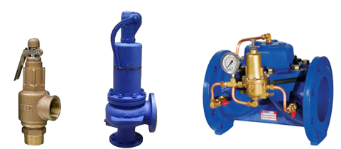
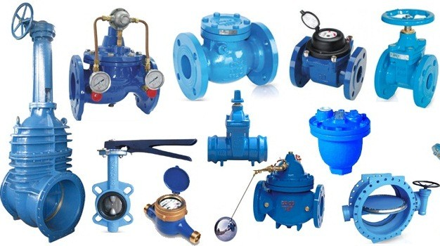

Van an toàn là một trong số những thiết bị nằm trong danh mục cần phải được kiểm định an toàn trước khi đưa vào vận hành. Hiện nay có khá nhiều những tai nạn đáng tiếc xảy ra liên quan đến van an toàn cho nên bắt buộc thiết bị này cần phải được kiểm định để tránh gây thiệt hại về người và của làm ảnh hưởng đến quá trình thi công, xây dựng và sản xuất của doanh nghiệp.

##Van an toàn là gì?

Van an toàn là cơ cấu bảo vệ thiết bị, không cho thiết bị làm việc quá áp suất quy định và là cơ cấu không thể thiếu trên mỗi thiết bị áp lực. Khi áp suất trong thiết bị áp lực tăng lên đến áp suất cài đặt của van an toàn thì van sẽ tự động mở giảm áp trong thiết bị.

Van an toàn được dùng phổ biến hiện nay có ba loại :

 - Van an toàn kiểu lò xo
 - Van an toàn kiểu đối trọng(quả tạ)
 - Van an toàn kiểu màng.
 
Van an toàn nếu muốn đảm bảo độ chính xác, tin cậy và an toàn thì bắt buộc phải được kiểm định ít nhất một năm một lần hoặc phải được kiểm định khi:

- Trước khi đưa thiết bị van an toàn vào hoạt động;
- Trong quá trình hoạt động của thiết bị van an toàn;
- Khi thiết bị van an toàn được tiến hành kiểm định định kỳ hoặc kiểm định bất thường.

###Kiểm định van an toàn diễn ra theo quy trình như thế nào?

Kiểm định van an toàn thường sẽ được tiến hành  theo trình tự :

- Nắm chung về tình trạng kỹ thuật của van an toàn bằng mắt thường.
- Dùng khí (Không khí nén, Nitơ) hoặc chất lỏng (nước, dầu chuyên dụng) nâng áp suất để kiểm tra áp suất tác động, áp suất đóng của van.
- Dùng thiết bị kỹ thuật để kiểm tra độ kín của van.

Quy trình thực hiện kiểm định van an toàn không hề đơn giản và đòi hỏi cần có những thiết bị chuyên dùng cùng với sự hoạt động của các kiểm định viên có trình độ và kinh nghiệm. Hiện nay không có nhiều đơn vị kiểm định có thể đáp ứng được những yêu cầu này ngoại trừ Công ty Kiểm định an toàn 24h, chúng tôi là một trong số rất ít cơ quan kiểm định tại Việt Nam có đầy đủ các tiêu chuẩn thực hiện kiểm định van an toàn.

###Tham khảo chi phí kiểm định van an toàn

<table class="table table-bordered">
    <tbody>
        <tr>
            <th width="330">Tên công việc</th>
            <th colspan="3">Đơn giá tối thiểu
             
            (chưa gồm thuế giá trị gia tăng)</th>
        </tr>
        <tr>
            <td rowspan="12">Kiểm định van an toàn
            (thực hiện tại Trung tâm)</td>
            <td rowspan="4">Áp suất đặt đến 30 bar</td>
            <td>&lt; 27 mm</td>
            <td>150.000 Đ</td>
        </tr>
        <tr>
            <td>&lt; 50 mm</td>
            <td>250.000 Đ</td>
            </tr>
        <tr>
            <td>&lt; 114 mm</td>
            <td>350.000 Đ</td>
        </tr>
        <tr>
            <td>≥ 114 mm</td>
            <td>450.000 Đ</td>
        </tr>
        <tr>
            <td rowspan="4">Từ trên 30 bar đến
            100 bar</td>
            <td>&lt; 27 mm</td>
            <td>250.000 Đ</td>
        </tr>
        <tr>
            <td>&lt; 50 mm</td>
            <td>350.000 Đ</td>
        </tr>
        <tr>
            <td>&lt; 114 mm</td>
            <td>450.000 Đ</td>
        </tr>
        <tr>
            <td>≥ 114 mm</td>
            <td>600.000 Đ</td>
        </tr>
        <tr>
            <td rowspan="4">Trên 100 bar</td>
            <td>&lt; 27 mm</td>
            <td>400.000 Đ</td>
        </tr>
        <tr>
            <td>&lt; 50 mm</td>
            <td>600.000 Đ</td>
        </tr>
        <tr>
            <td>&lt; 114 mm</td>
            <td>800.000 Đ</td>
        </tr>
        <tr>
            <td>≥ 114 mm</td>
            <td>1.000.000 Đ</td>
        </tr>
        <tr>
            <td rowspan="12">Sửa chữa thông thường van an toàn
            (thực hiện tại Trung tâm)</td>
            <td rowspan="4">Rà kín mặt tiếp xúc</td>
            <td>&lt; 50 mm</td>
            <td>300.000 Đ</td>
        </tr>
        <tr>
            <td>&lt; 114 mm</td>
            <td>400.000 Đ</td>
        </tr>
        <tr>
            <td>&lt; 200 mm</td>
            <td>500.000 Đ</td>
        </tr>
        <tr>
            <td>≥ 200 mm</td>
            <td>600.000 Đ</td>
        </tr>
        <tr>
            <td rowspan="4">Thay đệm mặt tiếp xúc</td>
            <td>&lt; 50 mm</td>
            <td>400.000 Đ</td>
        </tr>
        <tr>
            <td>&lt; 114 mm</td>
            <td>500.000 Đ</td>
        </tr>
        <tr>
            <td>&lt; 200 mm</td>
            <td>600.000 Đ</td>
        </tr>
        <tr>
            <td>≥ 200 mm</td>
            <td>700.000 Đ</td>
        </tr>
        <tr>
            <td rowspan="4">Gia công lại mặt tiếp xúc kim loại</td>
            <td>&lt; 50 mm</td>
            <td>400.000 Đ</td>
        </tr>
        <tr>
            <td>&lt; 114 mm</td>
            <td>600.000 Đ</td>
        </tr>
        <tr>
            <td>&lt; 200 mm</td>
            <td>800.000 Đ</td>
        </tr>
        <tr>
            <td>≥ 200 mm</td>
            <td>1.000.000 Đ</td>
        </tr>
    </tbody>
</table>

Công ty Kiểm định an toàn 24h là đơn vị chuyên cung cấp dịch vụ kiểm định van an toàn, cấp giấy chứng nhận kiểm định van an toàn cho các doanh nghiệp, tổ chức sử dụng van an toàn trong quá trình lao động.

Chúng tôi là đơn vị kiểm định an toàn duy nhất tại Việt Nam hiện có hệ thống máy nén khí có thể tạo áp suất khí nén đến 350 bar, hệ thống bơm thủy lực có thể tạo áp suất đến 800 bar, bàn thử chuyên dùng cho phép thử gần như tất cả các loại van an toàn theo những yêu cầu kỹ thuật khắt khe nhất.

Nếu có bất kỳ thắc mắc hoặc cần được tư vấn về dịch vụ kiểm định van an toàn, Quý khách vui lòng liên hệ :

Công ty cổ phần kiểm định đo lường và huấn luyện an toàn Việt Nam

Trụ sở chính: .................

Văn phòng giao dịch: .................

Điện thoại: 0984.126.797 (Mr. Tùng)

Email: kiemdinh247@gmail.com