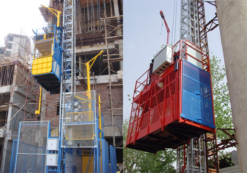
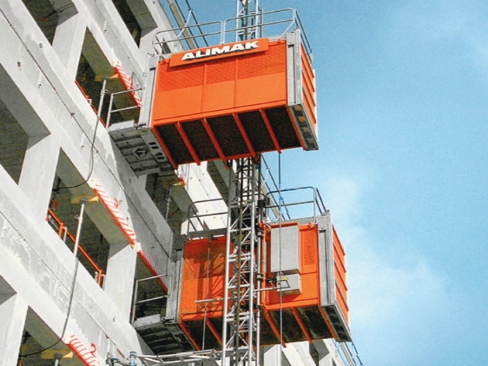

Vận thăng là thiết bị nâng hạ rất quan trọng trong các công trình xây dựng nhà cao tầng để vận chuyển hàng hoá và con người lên xuống. Đây cũng chính là thiết bị nằm trong số những thiết bị nhất định cần phải được tiến hành kiểm định an toàn trước khi vận hành theo quy định tại thông tư 05/2014/TT-BLĐTBXH ngày 06/03/2014 của Bộ LĐTBXH.

### Vận thăng là gì?

Như đã nói qua ở trên, vận thăng là thiết bị dùng để nâng lên hạ xuống hàng hoá và con người trong các công trình xây dựng nhà cao tầng. Vận thăng nâng hàng chuyên dùng để nâng vật liệu, dụng cụ lao động trong công tác hoàn thiện hoặc sữa chữa, xây dựng công trình. Máy chuyển động dẫn hướng theo phương thẳng đứng hoặc gần thẳng đứng, máy gọn nên không chiếm dụng không gian khi làm việc như các máy có cùng công dụng.

Là một thiết bị nâng hạ rất quan trọng, nên việc vận hành của thiết bị này cũng cần phải đảm bảo an toàn lao động, và phải được kiểm định an toàn một cách chắc chắn trước khi vận hành nhằm tránh những tai nạn đáng tiếc xảy ra.

Đối với một thiết bị máy móc như vận thăng thì việc thiết kế đảm bảo đặc tính an toàn với những thiết bị kiểm định, kiểm soát an toàn như thiết bị chống rời  trong trường hợp có sự cố làm cho lồng bị rơi bộ phanh bó chống rơi sẽ hoạt động ngay lập tức bó cứng bánh răng và giữ lồng, chống quá tải và thiết  bị an toàn bảo vệ chống điện.

### Quy trình kiểm định vận thăng bao gồm những gì?

**Phần điện**

- Kiểm tra sơ bộ bằng mắt thường

Kiểm tra dây cáp điện xem có hiện tượng sờn, xước, đứt, hở điện hoặc thiếu tin cậy không.

Kiểm tra hệ thống nút bấm điều khiển, nút bấm chuông, nút bấm dừng khẩn, đèn báo pha phải đảm bảo vận làm việc tốt.

- Kiểm tra chuyên sâu bằng các thiết bị chuyên dụng

Kiểm tra điện trở cách điện của động cơ, điện trở tiếp địa của thiết bị và vỏ ngoài kim loại, kết cấu thép cần phù hợp với yêu cầu quy định.

**Phần cơ khí**

- Kiểm tra sơ bộ bằng mắt thường

	- Kiểm tra bộ phận có chuyển động cơ học như dây cáp, pulley, dây cáp dẫn đối trọng, các ống hãm, chốt an toàn.

	- Kiểm tra hệ thống đốt nối, hệ thống con lăn, bánh tỳ, bánh răng cần phải đảm bảo tốt.

	- Kiểm tra hệ thống hành trình an toàn của cửa hàng rào và cửa lồng, cữ hành trình lên và xuống và trung gian phải hoạt động tốt, tin cậy.

- Kiểm tra chuyên sâu bằng các thiết bị chuyên dụng

	- Kiểm tra tình hình mài mòn của các con lăn dẫn động. Kiểm tra khe hở phải đảm bảo tiêu chuẩn đã quy định.

	- Kiểm tra độ mài mòn của má phanh động và tĩnh. Điều chỉnh khe hở quy định 0.3 mm.

	- Kiểm tra bộ phòng rơi qua việc tiến hành thử nghiệm rơi bằng cách ngắt điện đột ngột, khoảng cách rơi tải tự do cho phép thông thường là dưới 1m.

	- Kiểm tra, thử tải theo quy trình kiểm định

### Tham khảo chi phí kiểm định vận thăng

- Tải trọng nâng dưới 3 tấn: 700.000

- Tải trọng nâng từ 3,0 tấn trở lên: 1.500.000

- Vận thăng lồng chở người lên đến 10 người: 2.500.000

- Vận thăng lồng nâng người có số lượng trên 10 người: 3.000.000

Cũng theo quy định tại thông tư 05/2014/TT-BLĐTBXH ngày 06/03/2014 của Bộ LĐTBXH, công tác kiểm định an toàn kỹ thuật thiết bị vận thăng phải được thực hiện bởi các đơn vị có chức năng pháp lý và Công ty cổ phần kiểm định đo lường và huấn luyện an toàn Việt Nam chúng tôi chính là địa chỉ tin cậy để Quý khách lựa chọn để tiến hành công tác kiểm định vận thăng.

Công ty cổ phần kiểm định đo lường và huấn luyện an toàn Việt Nam với đội ngũ nhân viên kiểm định có kinh nghiệm và được đào tạo liên tục để nâng cao trình độ sẽ là đơn vị thực hiện công tác kiểm định vận thăng chính xác, đảm bảo nhất cho Quý khách!

Nếu có bất kỳ thắc mắc hoặc cần được tư vấn về dịch vụ kiểm định, Quý khách vui lòng liên hệ chúng tôi.